# 🚀 CompanyJob - Portal Lowongan Kerja


CompanyJob adalah sebuah **portal lowongan kerja** yang memudahkan perusahaan untuk memposting lowongan dan pencari kerja untuk melamar pekerjaan sesuai minat dan keahlian mereka.

---

## 🎯 Fitur Utama

### 👨‍💼 Untuk Pencari Kerja:
- ✅ Registrasi akun pencari kerja.
- 🔍 Melihat daftar lowongan kerja yang tersedia.
- 📨 Melamar ke lowongan kerja yang diminati.
- 📋 Melihat status lamaran.

### 🏢 Untuk Perusahaan:
- ✅ Registrasi akun perusahaan.
- ✍️ Posting lowongan kerja baru.
- 📄 Melihat daftar pencari kerja yang melamar.
- 🔄 Mengelola status lamaran.

---

## 🛠️ Teknologi yang Digunakan

### Backend:
- **Laravel 8** (Framework PHP)
- **MySQL** (Basis Data)

### Frontend:
- **HTML**, **CSS**, **JavaScript**
- **Bootstrap** untuk tampilan responsif dan interaktif

---

## ⚙️ Instalasi & Penggunaan

1. Clone repositori:
   ```bash
   git clone <https://github.com/BonifasiusEkky/Recruitment-WinnicodeIntern>
2. Masuk ke direktori proyek

3. Install dependensi PHP menggunakan Composer: composer install

4. Salin file .env.example menjadi .env dan sesuaikan konfigurasi basis data Anda.

5. Generate kunci aplikasi Laravel: php artisan key:generate

6. Jalankan migrasi basis data: php artisan migrate

7. Jalankan server lokal: php artisan serve

Dokumentasi 
Login-Register page 
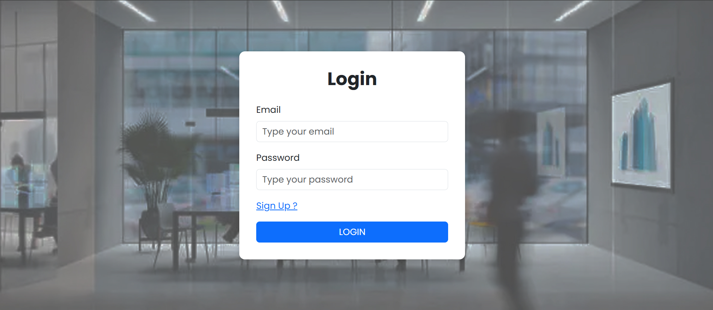
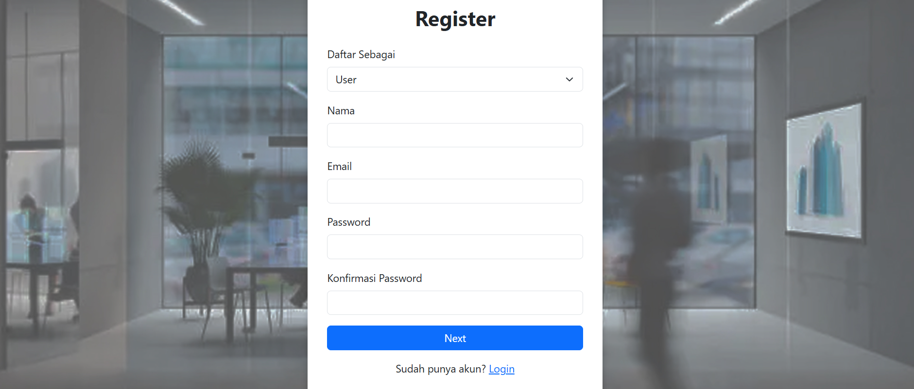


User
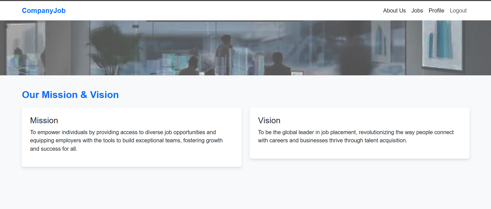
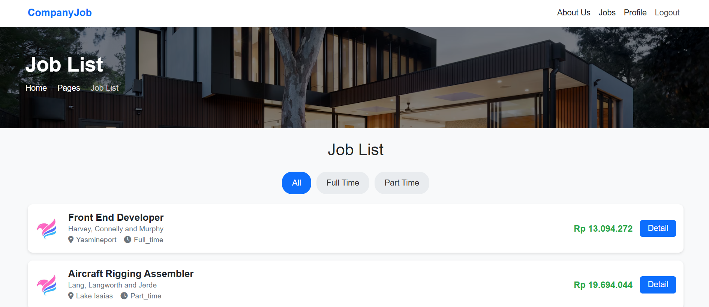
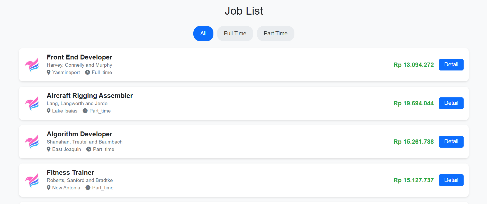
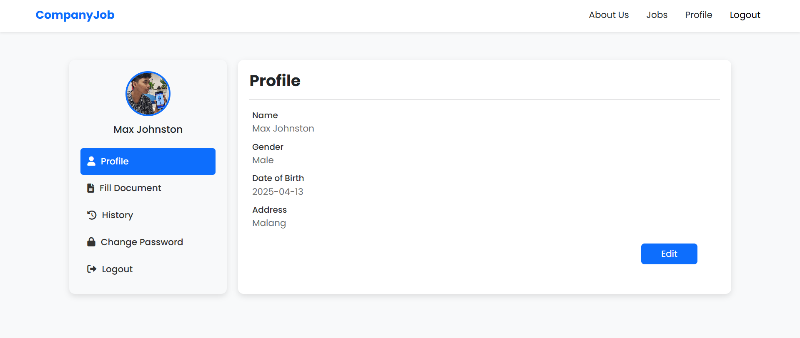

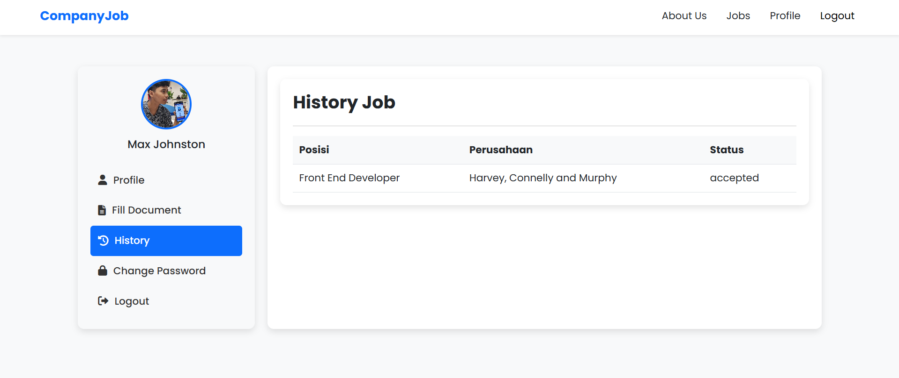

Admin 
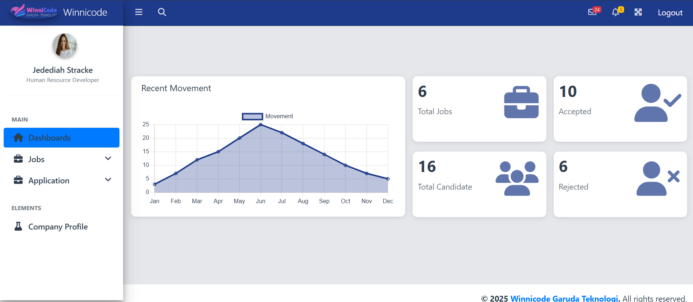
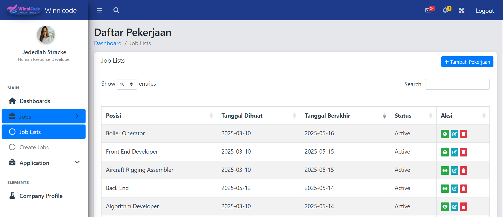
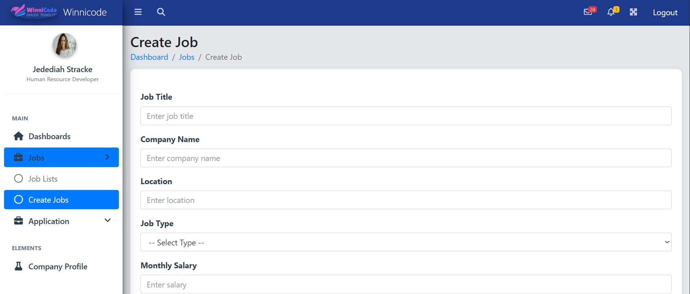
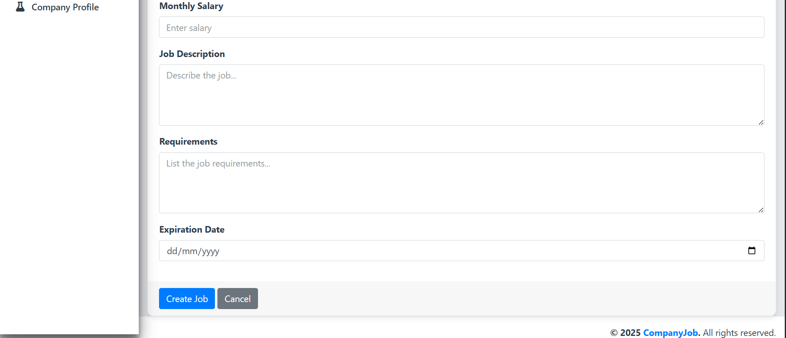
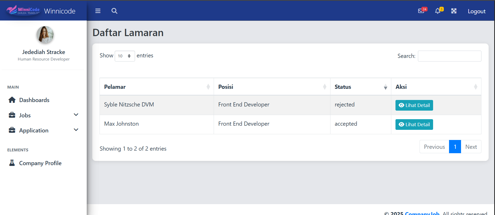
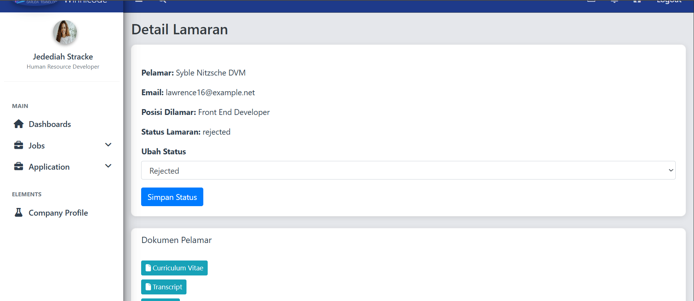
